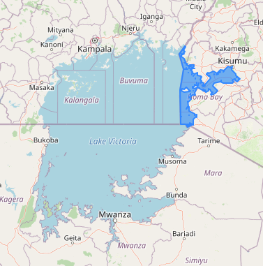

# Water-Quality-Monitoring
This project automates the monitoring of Kenya's side of Lake Victoria aquatic ecosystem with Earth Observation to assess water quality. Using satellite imagery, parameters like chlorophyll, turbidity, and suspended sediments are analyzed, enabling efficient, real-time insights for ecosystem health management and pollution control.



# Data Sources
The satellite data used in this project: **MODIS Aqua**
- MODIS offers Higher temporal resolution images(2 revisit times per day) at the cost of a coarser spatial resolution (500m)

## Spectral Indices used for the Water Quality Monitoring

- **Normalized Difference Chlorophyll Index (NDCI)**: A spectral index used to estimate the relative concentration of chlorophyll in water bodies.
- **Normalized Difference Turbidity Index (NDTI)**: Measures the cloudiness or haziness of water caused by large numbers of individual particles.
- **Chlorophyll-a Index**: Used to estimate the absolute concentration of chlorophyll-a in water bodies.
- **Suspended Sediment Concentration (SSC)**: Estimates the concentration of suspended sediments in water bodies.

NOTE: Run ```pip install -U "geemap[workshop]"``` after installing the requirements from the txt file.

The Dashboard app for this project: https://deepnote.com/app/owls-d007/Water-Quality-Monitoring-1016b0e9-5958-4dba-9237-19323a660a0c?utm_source=share-modal&utm_medium=product-shared-content&utm_campaign=data-app&utm_content=1016b0e9-5958-4dba-9237-19323a660a0c


